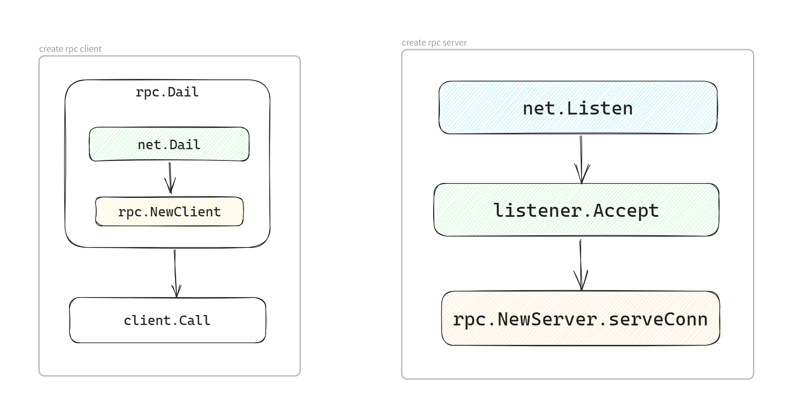
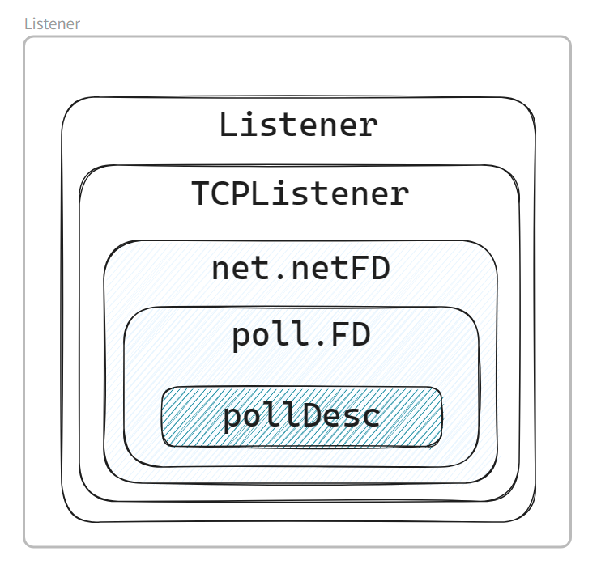
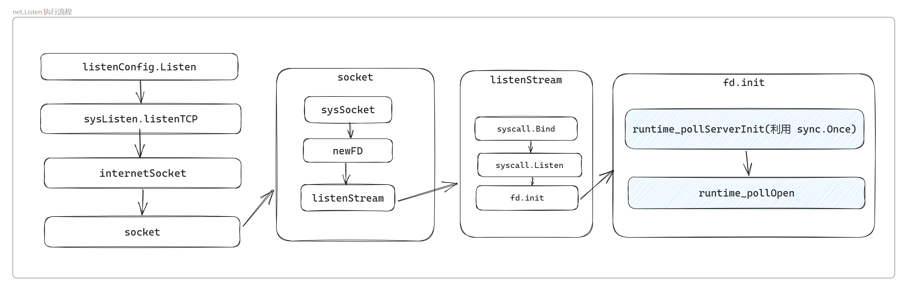
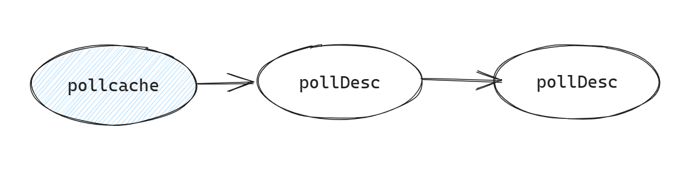
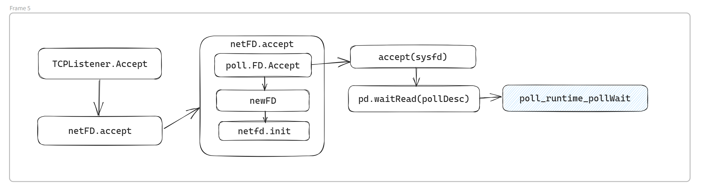

>事先声明：所有参考内容，会在结尾留下。
>
>为什么会对Golang 中 `net` 包进行分析，最近看完书中`netpoll`的讲解，之前也阅读过，但始终对于`net`包 和`netpoll`两者关系没有理清。然后又看到了字节跳动在自己开源的`netpoll`对于Go `net`包的评价。两者结合，对于net包的性能为何快，那么`netpoll`又扮演什么功能。
>
>本文仅对`net`包中`rpc`服务和客户端的创建流程，对于其中`netpoll`是何时被调用，之间的联系。
>
><font color=red>todo：文章某些内容细节没有分析到位，后续补充。</font>
>
>go version: 1.19.13

<!-- more -->

## `rpc`服务和客户端

### 创建和使用

> 在Go中创建一个`rpc`服务和客户端，其中基本上实现了rpc 协议的解码和编码、rpc 服务和客户端服务的连接和请求处理。下面先看一段代码示例和基本流程。 





<!-- tab rpc client -->

```go
package main

import (
	"fmt"
	"log"
	"net/rpc"
)

func main() {

	client, err := rpc.Dial("tcp", "localhost:8080")
	if err != nil {
		log.Fatal("dialing:", err)
	}

	var reply string
	err = client.Call("HelloService.Hello", "world", &reply)
	if err != nil {
		log.Fatal(err)
	}

    fmt.Println(reply)
}
```

<!-- endtab -->

<!-- tab rpc server -->

```go
package main

import (
	"log"
	"net"
	"net/rpc"
)

type HelloService struct {
}

func (p *HelloService) Hello(request string, reply *string) error {
	*reply = "hello " + request
	return nil
}

func main() {
	srv := rpc.NewServer()
	srv.RegisterName("HelloService", new(HelloService))

	listener, err := net.Listen("tcp", ":8080")
	if err != nil {
		log.Fatal("ListenTCP error:", err)
	}

	for {
		conn, err := listener.Accept()
		if err != nil {
			log.Fatal("Accept error:", err)
		}

		go srv.ServeConn(conn)
	}
}
```

<!-- endtab -->



上述代码流程里，我们实现了基本`rpc`服务创建，`rpc`客户端请求，在`hello server`处理请求数据，返回组合的数据，打印了`hello world`。 

---

### `rpc`服务流程详细分析

>针对上面的`rpc`服务创建流程，具体流程是怎么做的，`netpoll` 又充当了什么角色，为什么说`net`包实现的`rpc`是`BIO`模式的。
>
>下面对于其中`Listen`函数、`Accept`函数、`ServeConn`函数具体流程进行分析。

#### `Listen`函数

>先看一下`Listen`函数(由`Listener`结构实现)中，其`Listener`底层数据结构主要字段。
>
>从下图我们看到，`Listener` 结构体最终涉及调用了 `pollDesc`，而`pollDesc`是`netpoll`功能的主要数据结构，`pollDesc`封装了操作系统的文件描述符，从而监控了网络`IO`的请求。 而在`netpoll`中，在`linux`中主要通过`epoll`模型实现。



> 下面我们看一下整体函数调用链路。
>



> 接下来再对应实际代码分析一下。由上图和下列代码组合来看，到`socket`函数中，通过调用`sysScoket`函数创建系统`fd`文件标识符，然后通过`newFD`函数，构建`netFD`网络文件标识符。最终通过`sotype`判断，走向`listenStream`函数，调用系统内核`bind`函数和`Listen`函数完成`tcp`三次握手前的准备。
>
> 在`fd.init`函数流程：调用`pollDesc`中`init`函数（在这里开始使用`netpoll`组件中的函数）
>
> 1. 通过全局`serverInit(sync.Once全局变量)`执行`runtime_pollServerInit`，创建`epoll`的`fd`和`event`
> 2. 然后调用`runtime_pollOpen`打开系统`fd`，通过全局`pollcache`缓存链表中创建获取`pollDesc`。
> 3. 通过`epollctl`将`fd`和`pd`绑定，去顶事件的监听类型，加入监听队列。
>
> 在`pollCache`中，会构建一个全局资源`pollcache`，当链表中没有对应`pd`，则会根据参数，创建一批。**并且会保证这些数据结构在不会触发垃圾收集的内存中初始化，只会保证`epoll`和`kqueue`引用**（引自《Go语言涉及与实现》）。





<!-- tab socket 函数 -->

```go
func socket(ctx context.Context, net string, family, sotype, proto int, ipv6only bool, laddr, raddr sockaddr, ctrlFn func(string, string, syscall.RawConn) error) (fd *netFD, err error) {
	s, err := sysSocket(family, sotype, proto)
	if err != nil {
		return nil, err
	}
	if err = setDefaultSockopts(s, family, sotype, ipv6only); err != nil {
		poll.CloseFunc(s)
		return nil, err
	}
	if fd, err = newFD(s, family, sotype, net); err != nil {
		poll.CloseFunc(s)
		return nil, err
	}

	if laddr != nil && raddr == nil {
		switch sotype {
		case syscall.SOCK_STREAM, syscall.SOCK_SEQPACKET:
			if err := fd.listenStream(laddr, listenerBacklog(), ctrlFn); err != nil {
				fd.Close()
				return nil, err
			}
			return fd, nil
		case syscall.SOCK_DGRAM:
			if err := fd.listenDatagram(laddr, ctrlFn); err != nil {
				fd.Close()
				return nil, err
			}
			return fd, nil
		}
	}
	/*
	****
	*/
	return fd, nil
}

```

<!-- endtab -->

<!-- tab listenStream 函数-->

```go
func (fd *netFD) listenStream(laddr sockaddr, backlog int, ctrlFn func(string, string, syscall.RawConn) error) error {
	var err error
	if err = setDefaultListenerSockopts(fd.pfd.Sysfd); err != nil {
		return err
	}
	var lsa syscall.Sockaddr
	if lsa, err = laddr.sockaddr(fd.family); err != nil {
		return err
	}
	if ctrlFn != nil {
		c, err := newRawConn(fd)
		if err != nil {
			return err
		}
		if err := ctrlFn(fd.ctrlNetwork(), laddr.String(), c); err != nil {
			return err
		}
	}
	if err = syscall.Bind(fd.pfd.Sysfd, lsa); err != nil {
		return os.NewSyscallError("bind", err)
	}
    // 调用sysListen
	if err = listenFunc(fd.pfd.Sysfd, backlog); err != nil {
		return os.NewSyscallError("listen", err)
	}
	if err = fd.init(); err != nil {
		return err
	}
	lsa, _ = syscall.Getsockname(fd.pfd.Sysfd)
	fd.setAddr(fd.addrFunc()(lsa), nil)
	return nil
}
```

<!-- endtab -->

<!-- tab poll_runtime_pollOpen -->

```go
//go:linkname poll_runtime_pollOpen internal/poll.runtime_pollOpen
func poll_runtime_pollOpen(fd uintptr) (*pollDesc, int) {
	pd := pollcache.alloc()
	lock(&pd.lock)
	wg := pd.wg.Load()
	if wg != 0 && wg != pdReady {
		throw("runtime: blocked write on free polldesc")
	}
	rg := pd.rg.Load()
	if rg != 0 && rg != pdReady {
		throw("runtime: blocked read on free polldesc")
	}
	pd.fd = fd
	pd.closing = false
	pd.setEventErr(false)
	pd.rseq++
	pd.rg.Store(0)
	pd.rd = 0
	pd.wseq++
	pd.wg.Store(0)
	pd.wd = 0
	pd.self = pd
	pd.publishInfo()
	unlock(&pd.lock)

	errno := netpollopen(fd, pd)
	if errno != 0 {
		pollcache.free(pd)
		return nil, int(errno)
	}
	return pd, 0
}
```

<!-- endtab -->

<!-- tab pollcache.alloc() -->

```go
func (c *pollCache) alloc() *pollDesc {
	lock(&c.lock)
	if c.first == nil {
		const pdSize = unsafe.Sizeof(pollDesc{})
		n := pollBlockSize / pdSize
		if n == 0 {
			n = 1
		}
		// Must be in non-GC memory because can be referenced
		// only from epoll/kqueue internals.
		mem := persistentalloc(n*pdSize, 0, &memstats.other_sys)
		for i := uintptr(0); i < n; i++ {
			pd := (*pollDesc)(add(mem, i*pdSize))
			pd.link = c.first
			c.first = pd
		}
	}
	pd := c.first
	c.first = pd.link
	lockInit(&pd.lock, lockRankPollDesc)
	unlock(&c.lock)
	return pd
}
```

<!-- endtab -->



#### `Accept`函数

在分析`Accept`函数前，我们先看一下流程调用图。



根据上面的`Listen`函数分析，此时我们创建完对的系统`fd`和`pd(pollDesc)`。通过调用系统级别`accept`函数，监听系统`fd`，此时判断的`err`为`syscall.EAGAIN`，然后`netpoll`中调用`pollWait`阻塞，判断合适时，跳出，通过系统`accept`获取`fd(scoket)`，然后组合信息封装成`TCPConn`，给到下面的`ServeConn`函数处理。



<!-- tab netFD-accept -->

```go
func (fd *netFD) accept() (netfd *netFD, err error) {
	d, rsa, errcall, err := fd.pfd.Accept()
	if err != nil {
		if errcall != "" {
			err = wrapSyscallError(errcall, err)
		}
		return nil, err
	}

	if netfd, err = newFD(d, fd.family, fd.sotype, fd.net); err != nil {
		poll.CloseFunc(d)
		return nil, err
	}
	if err = netfd.init(); err != nil {
		netfd.Close()
		return nil, err
	}
	lsa, _ := syscall.Getsockname(netfd.pfd.Sysfd)
	netfd.setAddr(netfd.addrFunc()(lsa), netfd.addrFunc()(rsa))
	return netfd, nil
}

```

<!-- endtab -->

<!-- tab FD-accept -->

```go
func (fd *FD) Accept() (int, syscall.Sockaddr, string, error) {
	if err := fd.readLock(); err != nil {
		return -1, nil, "", err
	}
	defer fd.readUnlock()

	if err := fd.pd.prepareRead(fd.isFile); err != nil {
		return -1, nil, "", err
	}
	for {
		s, rsa, errcall, err := accept(fd.Sysfd)
		if err == nil {
			return s, rsa, "", err
		}
		switch err {
		case syscall.EINTR:
			continue
		case syscall.EAGAIN:
			if fd.pd.pollable() {
                // poll_runtime_pollWait
				if err = fd.pd.waitRead(fd.isFile); err == nil {
					continue
				}
			}
		case syscall.ECONNABORTED:
			// This means that a socket on the listen
			// queue was closed before we Accept()ed it;
			// it's a silly error, so try again.
			continue
		}
		return -1, nil, errcall, err
	}
}
```

<!-- endtab -->

<!-- tab poll_runtime_pollWait -->

```go
//go:linkname poll_runtime_pollWait internal/poll.runtime_pollWait
func poll_runtime_pollWait(pd *pollDesc, mode int) int {
	errcode := netpollcheckerr(pd, int32(mode))
	if errcode != pollNoError {
		return errcode
	}
	// As for now only Solaris, illumos, and AIX use level-triggered IO.
	if GOOS == "solaris" || GOOS == "illumos" || GOOS == "aix" {
		netpollarm(pd, mode)
	}
    // 阻塞
	for !netpollblock(pd, int32(mode), false) {
		errcode = netpollcheckerr(pd, int32(mode))
		if errcode != pollNoError {
			return errcode
		}
		// Can happen if timeout has fired and unblocked us,
		// but before we had a chance to run, timeout has been reset.
		// Pretend it has not happened and retry.
	}
	return pollNoError
}

```

<!-- endtab -->



#### `ServeConn`函数

在`ServeConn`函数流程中，先构建`gobServeCodec`结构，然后交给`ServeCodec`函数进行逐个调用处理。在`ServeCodec`函数中，进行每个请求体解析，然后分配一个`goroutinue`给到对应函数，通过反射的`call`函数进行调用返回。



<!-- tab ServeConn -->

```go
// ServeConn runs the server on a single connection.
// ServeConn blocks, serving the connection until the client hangs up.
// The caller typically invokes ServeConn in a go statement.
// ServeConn uses the gob wire format (see package gob) on the
// connection. To use an alternate codec, use ServeCodec.
// See NewClient's comment for information about concurrent access.
func (server *Server) ServeConn(conn io.ReadWriteCloser) {
	buf := bufio.NewWriter(conn)
	srv := &gobServerCodec{
		rwc:    conn,
		dec:    gob.NewDecoder(conn),
		enc:    gob.NewEncoder(buf),
		encBuf: buf,
	}
	server.ServeCodec(srv)
}

```

<!-- endtab -->

<!-- tab ServeCodec -->

```go
// ServeCodec is like ServeConn but uses the specified codec to
// decode requests and encode responses.
func (server *Server) ServeCodec(codec ServerCodec) {
	sending := new(sync.Mutex)
	wg := new(sync.WaitGroup)
	for {
		service, mtype, req, argv, replyv, keepReading, err := server.readRequest(codec)
		if err != nil {
			if debugLog && err != io.EOF {
				log.Println("rpc:", err)
			}
			if !keepReading {
				break
			}
			// send a response if we actually managed to read a header.
			if req != nil {
				server.sendResponse(sending, req, invalidRequest, codec, err.Error())
				server.freeRequest(req)
			}
			continue
		}
		wg.Add(1)
		go service.call(server, sending, wg, mtype, req, argv, replyv, codec)
	}
	// We've seen that there are no more requests.
	// Wait for responses to be sent before closing codec.
	wg.Wait()
	codec.Close()
}
```

<!-- endtab -->



---

### `rpc`客户端详细分析

#### `Dail`函数

在`Dail`函数中，传入`tcp`和`ip`，与服务端建立连接，返回一个`Conn`实例，然后通过构建一个新的`Client`实例，用于处理函数请求。在`Client`创建中，会先创建`buf`和`gobClientCodec`，在通过`gobClientCodec`构建`Client`中，会创建一个`goroutine`处理`client`的`input`函数，然后返回`Client`。



<!-- tab rpc.Dail -->

```go
// Dial connects to an RPC server at the specified network address.
func Dial(network, address string) (*Client, error) {
	conn, err := net.Dial(network, address)
	if err != nil {
		return nil, err
	}
	return NewClient(conn), nil
}
```

<!-- endtab -->

<!-- tab rpc-Client -->

```go
// NewClient returns a new Client to handle requests to the
// set of services at the other end of the connection.
// It adds a buffer to the write side of the connection so
// the header and payload are sent as a unit.
//
// The read and write halves of the connection are serialized independently,
// so no interlocking is required. However each half may be accessed
// concurrently so the implementation of conn should protect against
// concurrent reads or concurrent writes.
func NewClient(conn io.ReadWriteCloser) *Client {
	encBuf := bufio.NewWriter(conn)
	client := &gobClientCodec{conn, gob.NewDecoder(conn), gob.NewEncoder(encBuf), encBuf}
	return NewClientWithCodec(client)
}

// NewClientWithCodec is like NewClient but uses the specified
// codec to encode requests and decode responses.
func NewClientWithCodec(codec ClientCodec) *Client {
	client := &Client{
		codec:   codec,
		pending: make(map[uint64]*Call),
	}
	go client.input()
	return client
}
```

<!-- endtab -->

<!-- tab client-input -->

```go
func (client *Client) input() {
	var err error
	var response Response
	for err == nil {
		response = Response{}
		err = client.codec.ReadResponseHeader(&response)
		if err != nil {
			break
		}
		seq := response.Seq
		client.mutex.Lock()
		call := client.pending[seq]
		delete(client.pending, seq)
		client.mutex.Unlock()

		switch {
		case call == nil:
			// We've got no pending call. That usually means that
			// WriteRequest partially failed, and call was already
			// removed; response is a server telling us about an
			// error reading request body. We should still attempt
			// to read error body, but there's no one to give it to.
			err = client.codec.ReadResponseBody(nil)
			if err != nil {
				err = errors.New("reading error body: " + err.Error())
			}
		case response.Error != "":
			// We've got an error response. Give this to the request;
			// any subsequent requests will get the ReadResponseBody
			// error if there is one.
			call.Error = ServerError(response.Error)
			err = client.codec.ReadResponseBody(nil)
			if err != nil {
				err = errors.New("reading error body: " + err.Error())
			}
			call.done()
		default:
			err = client.codec.ReadResponseBody(call.Reply)
			if err != nil {
				call.Error = errors.New("reading body " + err.Error())
			}
			call.done()
		}
	}
	// Terminate pending calls.
	client.reqMutex.Lock()
	client.mutex.Lock()
	client.shutdown = true
	closing := client.closing
	if err == io.EOF {
		if closing {
			err = ErrShutdown
		} else {
			err = io.ErrUnexpectedEOF
		}
	}
	for _, call := range client.pending {
		call.Error = err
		call.done()
	}
	client.mutex.Unlock()
	client.reqMutex.Unlock()
	if debugLog && err != io.EOF && !closing {
		log.Println("rpc: client protocol error:", err)
	}
}
```

<!-- endtab -->



#### `Call`函数

在`Call`函数调用中，通过`Call`结构体中的`Done`字段(`channel`)来进行调用结束，以及`err`的返回。`Call`函数中，通过调用`Go`函数，构建`Call`结构体，然后调用`send`函数发送。



<!-- tab call-go -->

```go
// Go invokes the function asynchronously. It returns the Call structure representing
// the invocation. The done channel will signal when the call is complete by returning
// the same Call object. If done is nil, Go will allocate a new channel.
// If non-nil, done must be buffered or Go will deliberately crash.
func (client *Client) Go(serviceMethod string, args any, reply any, done chan *Call) *Call {
	call := new(Call)
	call.ServiceMethod = serviceMethod
	call.Args = args
	call.Reply = reply
	if done == nil {
		done = make(chan *Call, 10) // buffered.
	} else {
		// If caller passes done != nil, it must arrange that
		// done has enough buffer for the number of simultaneous
		// RPCs that will be using that channel. If the channel
		// is totally unbuffered, it's best not to run at all.
		if cap(done) == 0 {
			log.Panic("rpc: done channel is unbuffered")
		}
	}
	call.Done = done
	client.send(call)
	return call
}

// Call invokes the named function, waits for it to complete, and returns its error status.
func (client *Client) Call(serviceMethod string, args any, reply any) error {
	call := <-client.Go(serviceMethod, args, reply, make(chan *Call, 1)).Done
	return call.Error
}
```

<!-- endtab -->

<!-- tab send-->

```go
func (client *Client) send(call *Call) {
	client.reqMutex.Lock()
	defer client.reqMutex.Unlock()

	// Register this call.
	client.mutex.Lock()
	if client.shutdown || client.closing {
		client.mutex.Unlock()
		call.Error = ErrShutdown
		call.done()
		return
	}
	seq := client.seq
	client.seq++
	client.pending[seq] = call
	client.mutex.Unlock()

	// Encode and send the request.
	client.request.Seq = seq
	client.request.ServiceMethod = call.ServiceMethod
	err := client.codec.WriteRequest(&client.request, call.Args)
	if err != nil {
		client.mutex.Lock()
		call = client.pending[seq]
		delete(client.pending, seq)
		client.mutex.Unlock()
		if call != nil {
			call.Error = err
			call.done()
		}
	}
}
```

<!-- endtab -->



----

## 总结

server端：

在`netpoll`组件里面处理网络I/O时，`net`包底层在`linux`系统里面使用对应的`epoll`模型，更为高效的创建和处理。但在处理对应连接请求时，主协程进行连接的接收，在server 实例中，调用`ServeConn`函数创建一个协程来单独处理网络连接请求，尽管已经很高效的运行了。但仍然有问题：**协程数量没有控制**。在`gnet`中，有效的解决了这些问题。

client端：

> 此处暂时理解不是很全面，后期进行补充。
>
> todo

发送请求时，主协程会通过创建一个协程，处理请求返回信息。


## 参考

> 《Go语言设计与实现》
